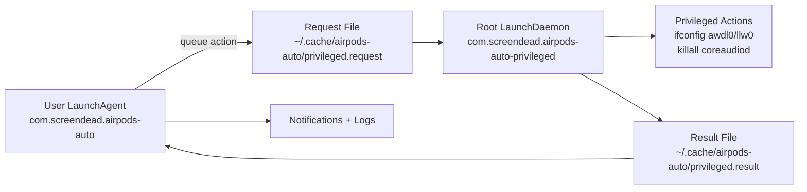

# AirPods Auto-Heal (macOS)

Installable launchd automation for AirPods stability on Mac:
- keeps audio stable while AirPods are connected
- restores Continuity features after disconnect
- auto-recover on sustained Bluetooth degradation
- sends macOS notifications for connect/disconnect, degradation, requests, and completion status

## What It Installs

- User LaunchAgent: `com.screendead.airpods-auto`
- Root LaunchDaemon: `com.screendead.airpods-auto-privileged`
- User watcher script in `~/Library/Application Support/airpods-auto-heal`
- Root worker script in `/usr/local/libexec/airpods_auto_privileged_worker.sh`

## Architecture



## Requirements

- macOS
- `blueutil` installed (`brew install blueutil`)
- admin rights (one-time, for daemon install)

## Install

```bash
chmod +x install.sh
./install.sh
```

During install, if `AIRPODS_ID` is empty, the installer auto-detects likely AirPods devices.
If multiple candidates are found, it asks you which one to use.

Non-interactive install (no prompts, picks first candidate):

```bash
./install.sh --non-interactive
```

Non-interactive with explicit device ID:

```bash
./install.sh --non-interactive --airpods-id 30-7a-d2-8e-97-c4
```

Enable dry-run mode (no privileged actions executed):

```bash
./install.sh --dry-run
```

Enable debug logging:

```bash
./install.sh --debug
```

Combine all modes:

```bash
./install.sh --non-interactive --airpods-id XX-XX-XX-XX-XX-XX --dry-run --debug
```

## Uninstall

```bash
chmod +x uninstall.sh
./uninstall.sh
```

## Configure AirPods Device ID

Edit:

`~/.config/airpods-auto-heal/config.env`

Default:

```bash
AIRPODS_ID=
DRY_RUN=0
DEBUG=0
```

Find current connected Bluetooth devices:

```bash
blueutil --connected
```

Auto-detect likely AirPods IDs:

```bash
"$HOME/Library/Application Support/airpods-auto-heal/detect_airpods_id.sh" --list
```

Write the best detected candidate into config automatically:

```bash
"$HOME/Library/Application Support/airpods-auto-heal/detect_airpods_id.sh" --write
```

## Safety (Privileged Behavior)

This project installs a root LaunchDaemon and runs privileged commands in response to queued actions.

Privileged commands used:
- `/sbin/ifconfig awdl0 down|up`
- `/sbin/ifconfig llw0 down|up`
- `/usr/bin/killall coreaudiod` (recover action only)

No network calls are made by runtime scripts beyond local system commands.

## Failure Modes and Recovery Policy

Degradation signal window:
- last 30 seconds of `bluetoothd` log events

A window is severe when any of these are true:
- `ReTx >= 80`
- `A2DP packet flushed count >= 20`
- `NoSync >= 100`

Recovery trigger:
- 3 consecutive severe windows
- and at least 600 seconds since last recovery

Continuity restore trigger:
- AirPods disconnected
- 90-second delay
- and at least 300 seconds since last restore request attempt

Expected notifications:
- AirPods connected/disconnected
- degradation detected
- action requested
- action completed / failed

## Debug and Dry-Run

- `DRY_RUN=1`:
	- watcher still detects/queues logically
	- privileged worker does not execute system-changing commands
	- completion still recorded as dry-run execution

- `DEBUG=1`:
	- adds extra debug lines to logs

## Logs

- `~/.cache/airpods-auto/agent.log`
- `~/.cache/airpods-auto/privileged.log`
- `~/.cache/airpods-auto/agent.err`
- `~/.cache/airpods-auto/privileged.err`

## Manual Service Checks

```bash
launchctl print gui/$(id -u)/com.screendead.airpods-auto | sed -n '1,80p'
sudo launchctl print system/com.screendead.airpods-auto-privileged | sed -n '1,80p'
```

## Notes

- Root daemon may appear as not running between intervals; that is normal.
- The user watcher runs every 15 seconds.
- Privileged worker runs every 5 seconds and processes queued actions.

## Development Quality Checks

Shell linting is run in CI using ShellCheck for:
- `install.sh`
- `uninstall.sh`
- `templates/*.sh`

## License

This project uses a custom non-commercial attribution license.
See LICENSE for full terms.
